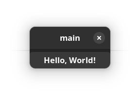

# Hello, Adwaita

In this lesson we will be taking a look into GNOME's Adwaita library, it brings us styles and widgets that are more inline with [GNOME's Human Interface Guidelines](https://developer.gnome.org/hig/) (HIG)

This is the part that makes us say that we are developing a 'GNOME Application' since we are now following GNOME's HIG and using their set of looks and styles.

If you want to build a generic GTK4 application that does not rely on a specific platform look, that's also fine and you can skip this chapter but be prepared to have alternatives to anything Adwaita related we may use.

Likewise some users may prefer to target a different platform, for example elementaryOS is another common target and they include their own library called Granite, so you may replace Adwaita with some stuff that they offer instead.

To get started with Adwaita it's as simple as replacing our `Gtk.Application` and `Gtk.ApplicationWindow` with ones that come with Adwaita like so:

```cs
~int main (string[] args) {
    var app = new Adw.Application ("com.example.test", ApplicationFlags.DEFAULT_FLAGS);
    
    app.activate.connect (() => {
        var window = new Adw.ApplicationWindow (app);
        window.present ();
    });
    ~
    ~return app.run ();
~}
```

To build our code we now need to include the dependency for Adwaita

```sh
valac --pkg gtk4 --pkg libadwaita-1 main.vala
```

Now if we run our program, something unexpected happens:


We get a blank window that we can't close! There are no window decorations, so you should send `CTRL + C` from your terminal to close the window or use some shortcut for closing windows such as `Alt + F4`

This is because Adwaita's `ApplicationWindow` behaves a little differently and requires us that we include the `HeaderBar` ourselves.

For now we can include an `Adw.HeaderBar` inside a vertical box so that it can contain a headerbar and the rest of our elements.

```cs
~int main (string[] args) {
    ~var app = new Adw.Application ("com.example.test", ApplicationFlags.DEFAULT_FLAGS);
    ~
    ~app.activate.connect (() => {
         ~var window = new Adw.ApplicationWindow (app);
         var box = new Gtk.Box (Gtk.Orientation.VERTICAL, 5);
         
         var button = new Gtk.Button ();
         button.set_label ("Hello, World!");

         box.append (new Adw.HeaderBar ());
         box.append (button);
         
         window.set_child (box);
         ~window.present ();
    ~});
    ~
    ~return app.run ();
~}
```

Running this however causes a crash!

```
(main:176796): Adwaita-ERROR **: 03:23:18.945: gtk_window_set_child() is not supported for AdwWindow
```

What happened? It's just a special exception that Adwaita's window wants you to set a different property to include children and one is not supposed to use `set_child` directly.

This property is called `content` and so we can set it using `set_content`

```cs
~int main (string[] args) {
    ~var app = new Adw.Application ("com.example.test", ApplicationFlags.DEFAULT_FLAGS);
    ~
    ~app.activate.connect (() => {
         ~var window = new Adw.ApplicationWindow (app);
         ~var box = new Gtk.Box (Gtk.Orientation.VERTICAL, 5);
         ~
         ~var button = new Gtk.Button ();
         ~button.set_label ("Hello, World!");
         ~
         ~box.append (new Adw.HeaderBar ());
         ~box.append (button);
         ~
         window.set_content (box);
         ~window.present ();
    ~});
    ~
    ~return app.run ();
~}
```

And we are back to something that looks similar to what we had in the earlier chapter:



## Conclusion

This was a quick chapter on integrating libadwaita with your program, so far not a lot has changed but libadwaita contains a lot more widgets that can really make your application look nicer and provide additional functionality and save time.

> You can also browse Adwaita's [Widget Gallery](https://gnome.pages.gitlab.gnome.org/libadwaita/doc/main/widget-gallery.html) to get an idea of what is possible!

But Adwaita is completely optional, if you are trying to stay desktop agnostic, want to use another widget library or just don't like Adwaita, then feel free to omit this part.