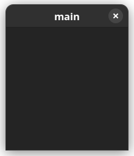
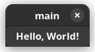
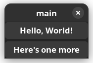

# Hello GTK!

In this lesson we are finally ready to harness the power of GTK within Vala.

Create a `main.vala`:

```cs
int main (string[] args) {
    // Code goes here...
    return 0;
}
```

That's our starter template, in the following sections we will focus on what to add in there and will be hiding the additional lines by default but you can choose to expand the codeblock when you desire by clicking on the eye icon.

First we create an instance of `Gtk.Application` this will be our main application instance that's responsible to manage everything.

```cs
~int main (string[] args) {
    var app = new Gtk.Application ("com.example.test", ApplicationFlags.DEFAULT_FLAGS);
~    return 0;
~}
```

To construct a `Gtk.Application` we need two things, an Application ID and flags determining some behaviors of the application, such as its capability to open files.

In this example we chose `com.example.test` and specified the default flags using `ApplicationFlags.DEFAULT_FLAGS`.

> Note: If you are running an older GLib version `ApplicationFlags.DEFAULT_FLAGS` may not exist, in that scenario use `ApplicationFlags.FLAGS_NONE` which was deprecated since glib 2.74

For choosing an Application ID, refer to the [GNOME Developers Documentation on Application ID](https://developer.gnome.org/documentation/tutorials/application-id)

We can now run the application using `app.run ()` this also conveniently returns an exit code so we can replace that `return 0;` with the code returned by the application's exit code:

```cs
~int main (string[] args) {
    var app = new Gtk.Application ("com.example.test", ApplicationFlags.DEFAULT_FLAGS);
    return app.run ();
~}
```

We can now try compiling and running our progress so far, but now since we used GTK, we need to tell Vala to bring in the GTK bindings which is pretty easy:

```sh
valac --pkg gtk4 main.vala
```

We specified `--pkg gtk4` to bring in the `gtk4` bindings before compiling `main.vala`

Now try running it with `./main` and it doesn't really do anything, you will probably get a warning like:

```
(main:131173): GLib-GIO-WARNING **: 03:41:38.246: Your application does not implement g_application_activate() and has no handlers connected to the 'activate' signal.  It should do one of these.
```

What does this mean? Well our application is currently not doing anything at all, and GTK is warning us that we should probably handle the `activate` signal which is triggered when the application starts and do something.

So let's stop being a ghost and actually display something, what do applications normally display? A Window that is, yes.

In Vala signals can be accessed like properties, so we can just access it via `app.activate` and then signals provide a `.connect` method we can use to attach a signal handler so we can do:

```cs
~int main (string[] args) {
    ~var app = new Gtk.Application ("com.example.test", ApplicationFlags.DEFAULT_FLAGS);
    ~
    app.activate.connect (() => {
        // Do stuff.
    });
    ~
    ~return app.run ();
~}
```

So this signal triggers when the application has activated and signals that we are ready to display our windows so let's just do that:


```cs
~int main (string[] args) {
    ~var app = new Gtk.Application ("com.example.test", ApplicationFlags.DEFAULT_FLAGS);
    ~
    ~app.activate.connect (() => {
        var window = new Gtk.ApplicationWindow (app);
        window.present ();
    ~});
    ~
    ~return app.run ();
~}
```

Here we created a window using the `Gtk.ApplicationWindow` which is basically a `Gtk.Window` but with some extra functionality to work better with the application instance, this is the perfect class for presenting the main application window.

The `Gtk.ApplicationWindow` takes one parameter which is the application itself, so we give it that.

Lastly windows are created hidden by default so we need to `present` them to the user.

Now try to build and run the application again, you remember the command right? Jeez, just scroll up.

This time we should finally have a window!



Behold! Our application is alive! Okay, I admit that's not really interesting, we got a blank window that does nothing at all.

## Widgets

GTK is a widget-toolkit, meaning that the UI is composed of a hierachy of objects known as widgets. Widgets can be many things such as buttons, text, checkboxes, etc.

Some widgets behave as "containers" meaning they can hold one or more widgets inside itself ("children") while others are standalone widgets like a button.

The `Gtk.ApplicationWindow` we created earlier is a container widget, it is currently empty but let's try adding a widget onto it:

```cs
~int main (string[] args) {
    ~var app = new Gtk.Application ("com.example.test", ApplicationFlags.DEFAULT_FLAGS);
    ~
    ~app.activate.connect (() => {
        ~var window = new Gtk.ApplicationWindow (app);
    ~  
        var button = new Gtk.Button ();
        button.set_label ("Hello, World!");

        window.set_child(button);
        ~window.present ();
    ~});
    ~
    ~return app.run ();
~}
```

Running this results in:



- The first line creates a `Gtk.Button` widget, widgets are just objects or classes so they can be constructed with `new`
- The second line uses the `set_label` method of the button widget to give it a text label, each widget will have its own set of behaviors and methods to interact with.
- The third line sets the button as the window's "child" so it is shown as part of it, note that the window only accepts one child.

Because the window can only contain one child, we usually use a **layout widget** as the root child of the window such as a list, box or a grid and lay the rest of our UI components within those.

A simple one to start with is `Gtk.Box` which contains multiple items and presents them with a given orientation: vertically or horizontally.

For example if we wanted to display two buttons on top of each other (vertically) we'd use a box like so:

```cs
~int main (string[] args) {
    ~var app = new Gtk.Application ("com.example.test", ApplicationFlags.DEFAULT_FLAGS);
    ~
    ~app.activate.connect (() => {
        ~var window = new Gtk.ApplicationWindow (app);
        var box = new Gtk.Box (Gtk.Orientation.VERTICAL, 5);

        var button = new Gtk.Button ();
        button.set_label ("Hello, World!");

        var button2 = new Gtk.Button ();
        button2.set_label ("Here's one more");

        box.append (button);
        box.append (button2);

        window.set_child(box);
        ~window.present ();
    ~});
    ~
    ~return app.run ();
~}
```

This will result in:



- A box is created with `new Gtk.Box ()`, this widget takes 2 things, an orientation horizontal (`Gtk.Orientation.HORIZONTAL`) or vertical (`Gtk.Orientation.VERTICAL`) and a spacing which is set to `5` here to give some room between elements so that the two buttons aren't touching each other.
- A box is a container that can hold multiple widgets, in this case we can use the `append` method of the box to add **children**
- Finally we set the box as the window's root child so it can display the box that contains more widgets than one.

This is how UI applications are laid out, in a tree-like structure where it starts with the window and then widgets branch out with more children containing sub-elements that compose the view hierarchy.

> You can check out a list of widgets that Gtk has to offer in the [Widget Gallery](https://docs.gtk.org/gtk4/visual_index.html)

## Signals

An important part of GTK is the ability to listen to **signals** and act on them, we've already seen a signal which was the `activate` signal of the `Gtk.Application` this signal is triggered to signal that GTK is fully activated and we are allowed to start displaying widgets so that's where we start showing our window.

> Signals are similar to what may be called "events" and "event handlers" in other languages and frameworks.

Likewise many other widgets out there may have various signals to notify us of something that happened within it, a good example is the `Button` widget we've already used, what good is a button that does nothing? That's where signals come in, buttons have a `clicked` signal that fires when it's pressed so let's listen to it and act on it.


```cs
~int main (string[] args) {
    ~var app = new Gtk.Application ("com.example.test", ApplicationFlags.DEFAULT_FLAGS);
    ~
    ~app.activate.connect (() => {
        ~var window = new Gtk.ApplicationWindow (app);
        ~  
        ~var button = new Gtk.Button ();
        ~button.set_label ("Hello, World!");
        button.clicked.connect (() => {
            stdout.printf ("Button Pressed\n");
        });
        ~
        ~window.set_child(button);
        ~window.present ();
    ~});
    ~
    ~return app.run ();
~}
```

This `connect`s into the button's `clicked` signal and in response prints a message to the standard output, now when you press the button you should start seeing the message in your terminal!


## Conclusion

In this chapter we learned a decent amount to get started, including how to construct object instances in Vala using `new` and the basics of GTK Widgets and how they are laid out and nested.

We've also seen the basics of 'signals' which may be called 'events' on some other languages, signals can be `connect`ed to run some code upon activation of that signal.

In this case the application emits the `activate` signal to notify us that it's ready and we connected to that signal so that when it happens we create our top level application window and `present` it.

Signals are used a lot throughout GTK such as when listening for button clicks and so on, therefore it's important to get comfortable working with them later on.
